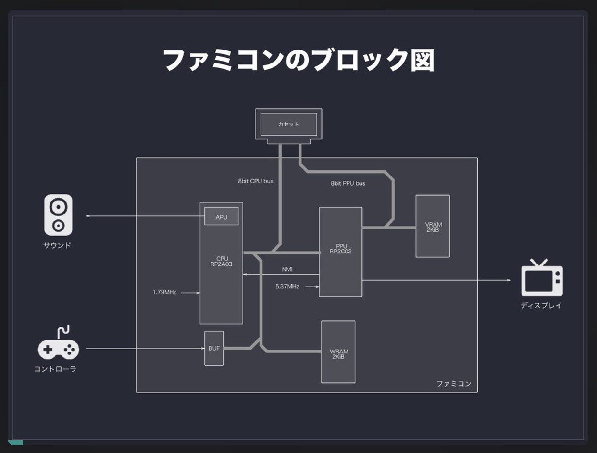
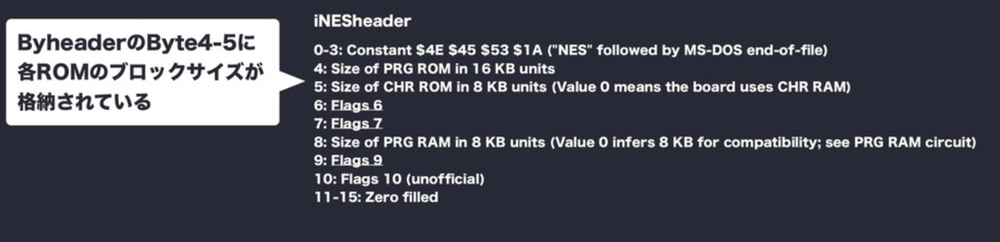

# nes_emu

https://www.notion.so/sunjin110/Go-1422a4b99be980a2b0e3c43ba6840510

# plan

- [ ] *.nesを読んで解析、各ROMを切り出しする
-> https://qiita.com/bokuweb/items/1575337bef44ae82f4d3 hello worldする
- [ ] RAMの実装 : 参考: <a harf="https://speakerdeck.com/bokuweb/huamikonemiyuretafalsechuang-rifang?slide=35">Example</a>
- [ ] CPUがSRAMの情報を取得できる様にする https://speakerdeck.com/bokuweb/huamikonemiyuretafalsechuang-rifang?slide=38
- 

# 作成するもの
- CPU: 6502ベースのもの、clock数は1.79MHz, MOS6502から不要な機能を削り、APUとDACを実装。
- PPU: ピクチャープロセッサーユニット  
    キャラクターROMから画像データを読んで画面上に配置する
- ROM: 32KiB + キャラクタROM 8KiB
- WRAM: ワーキングRAM 2KiB
- VRAM: ビデオRAM 2KiB
- 色: 52色
- 画面解像度: 256 x 240 ピクセル
- サウンド: 矩形波1/2, 三角波, ノイズ, DPCM
- コントローラー: ↑, ⇩, ←, →, A, B, start, select

# 構成図

# メモ

## カセット

### プログラムROM
ゲームプログラムが格納されたROM  
CPUはプログラムROMから命令フェッチしてプログラムを実行する

### キャラクターROM
8x8のゲーム画像が格納されたROM(最大8KiB)
背景とキャラクターそれぞれのデータが詰まっていいる  
PPUがキャラクターROMから画像データを読んで画面上に配置する  

### iNESフォーマット
- iNES header: 先頭16Byte  

- プログラムROM: 16KiByte * Block size
- キャラクターROM: 16KiByte * Block size

# CPUレジスタ一覧
スタックポイントは16ビットのアドレス空間を指す必要があるが、上位8bitは0x01に固定
(WRAMのうち0x100~0x01FFが割り当てられる)
すなわち、スタックポインタレジスタが0xA0の場合、スタックポインタは0x01A0になる

